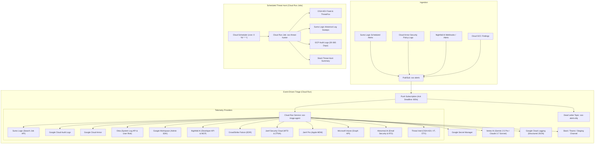

# Master Project Plan: GCP-Native Autonomous SOC Agent System

## 1. Executive Summary

This project implements an enterprise-grade autonomous Security Operations Center (SOC) agent platform natively deployed on **Google Cloud Platform (GCP)**. It takes architectural inspiration from the Scanner.dev AI SOC agent series:
- [Part 1: Foundations and Your First Agent](https://scanner.dev/blog/building-your-first-ai-soc-agents-foundations-and-your-first-agent-part-1)
- [Part 2: Deploying Triage and Threat Hunting Agents on AWS](https://scanner.dev/blog/building-your-first-ai-soc-agents-deploying-triage-and-threat-hunting-agents-in-aws-part-2)
- [Nightfall Developer API & MCP Documentation](https://help.nightfall.ai/developer-api)

It adapts the AWS-based reference architecture (Lambda + SQS + ECS Fargate) into a high-performance, container-native GCP architecture (Cloud Run + Cloud Run Jobs + Cloud Pub/Sub + Cloud Scheduler + Vertex AI) and expands the telemetry matrix to cover 11 industry-standard enterprise security tools.

---

## 2. The Core Philosophy

### 2.1 Hypothesis-Driven Investigation
Agents do not jump to rapid conclusions based on isolated alerts. For every incoming alert, the agent:
1. Formulates 2–4 competing hypotheses ranked by initial likelihood:
   - **Benign**: Authorized administrative task, scheduled cron/automation, legitimate traveling user.
   - **Policy Violation / Misconfiguration**: Accidental secret exposure, unsanctioned SaaS sharing, misconfigured CI pipeline.
   - **Active Malicious Compromise**: Credential theft, session hijacking, lateral movement, malware execution.
   - **Insider Threat**: Authorized employee accessing data outside normal operational baselines.
2. Executes targeted, read-only queries across the 11 telemetry sources to test each hypothesis.
3. Weighs evidence to corroborate or refute each hypothesis.

### 2.2 Double Self-Critique Loop
Before finalizing any classification:
- **Pass 1 (Blind Spot Discovery)**: Identifies omitted data sources, unverified IP categories (e.g. corporate VPN or ZTNA egress), and potential false assumptions.
- **Pass 2 (Confidence Calibration)**: Checks if the confidence percentage is justified by tangible technical artifacts (hashes, MFA methods, device compliance) rather than superficial pattern matches.

### 2.3 Staging for Human Review ("Questions, Not Instructions")
- The agent strictly possesses **read-only investigation** capabilities.
- Destructive actions (e.g., revoking Okta sessions, isolating CrowdStrike hosts, deleting exposed files in Nightfall) are never executed automatically.
- Outputs end with **actionable questions for the SOC analyst** to verify out-of-band context (e.g., change tickets, user travel, approved pen-testing).

### 2.4 Structured JSON Audit Trail
Every intermediate tool call (queries, parameters, execution timestamps) and final verdict is emitted to standard output as structured JSON, immediately parsed and indexed by **Google Cloud Logging**.

---

## 3. Architecture & Infrastructure Mapping



---

## 4. Multi-Source Telemetry Matrix

| Layer | System | Integration Mechanism | Key Investigative Signals |
| :--- | :--- | :--- | :--- |
| **Audit Logs** | **Sumo Logic** | REST Search Job API | Multi-cloud access logs, on-prem VPN, cross-service event correlation |
| **Cloud Audit**| **Google Cloud Audit Logs** | Cloud Logging API | `SetIamPolicy`, Service Account key creation, BigQuery/Storage data reads |
| **WAF / Edge** | **Google Cloud Armor** | Cloud Logging / Compute API | Evaluated WAF rules (`OWASP_TOP_10`), blocked IPs, Adaptive Protection alerts |
| **Primary IdP**| **Okta** | Okta System Log API (`/api/v1/logs`) | Authentication factors (FastPass/FIDO2 vs SMS), ThreatInsight, impossible travel |
| **SaaS Audit** | **Google Workspace** | Admin SDK Reports API | User logins, 2FA challenges, Drive external file shares, OAuth app grants |
| **Cloud DLP**  | **Nightfall.AI** | Developer API & MCP Server | 26 Read-only tools (`search_violations`, `search_exfiltration_events`, leaked secrets) |
| **EDR**        | **CrowdStrike Falcon**| Falcon OAuth2 API | Active detections, host health, containment status, process execution trees |
| **MTD & ZTNA** | **Jamf Security Cloud**| Radar API | OS compromise, jailbreak/root, malicious Wi-Fi, blocked C2 connections |
| **Apple MDM**  | **Jamf Pro** | Jamf Pro Classic / Pro API | Device enrollment, FileVault 2 encryption, macOS version compliance |
| **Cross MDM**  | **Microsoft Intune** | Microsoft Graph API | Windows/Mobile compliance, BitLocker, Azure AD device registration |
| **Email / ATO**| **Abnormal.AI** | Abnormal Security API | Phishing attacks, BEC, suspicious mailbox rules, compromised account cases |
| **Threat Intel**| **CISA KEV / VT** | Public Feeds & REST APIs | Known exploited CVEs, IP/Domain/File reputation scores |

---

## 5. Directory & Package Layout

```
agenticSOC/
├── AGENTS.md                          # Global context & rules for Antigravity instances
├── GEMINI.md                          # Compatibility pointer for Gemini/Antigravity
├── PROJECT_PLAN.md                    # Master architectural specification
├── Makefile                           # Local development, test, and deployment targets
├── requirements.txt                   # Production dependencies
├── Dockerfile                         # Cloud Run & Cloud Run Jobs multi-target container
├── .env.example                       # Full template environment configuration
├── .agents/
│   ├── mcp_config.json                # Preconfigured MCP server endpoints (Nightfall, Scanner, Slack)
│   └── skills/
│       └── gcp-soc-agent/
│           ├── SKILL.md               # Antigravity skill definition & runbook
│           └── references/
│               ├── architecture.md    # GCP deployment & Terraform architecture
│               ├── telemetry.md       # API specs for all 11 security integrations
│               └── prompts.md         # Exact prompts, schemas, and self-critique loops
├── src/
│   └── agenticsoc/
│       ├── __init__.py
│       ├── config.py                  # Settings resolution (Env vars & Secret Manager)
│       ├── cli.py                     # Local CLI test harness (`triage`, `hunt`)
│       ├── models/
│       │   ├── alert.py               # Inbound alert schemas
│       │   └── report.py              # Outbound structured TriageReport & ThreatHuntReport
│       ├── core/
│       │   ├── llm.py                 # Unified Vertex AI & Anthropic LLM client
│       │   ├── prompts.py             # System prompts with double self-critique
│       │   └── logger.py              # Structured Cloud Logging JSON emitter
│       ├── tools/
│       │   ├── base.py                # Abstract tool class with live & mock modes
│       │   ├── sumo_logic.py          # Sumo Logic Search Job API client
│       │   ├── gcp_audit_logs.py      # Google Cloud Audit Logs client
│       │   ├── cloud_armor.py         # Google Cloud Armor client
│       │   ├── okta.py                # Okta System Log client
│       │   ├── google_workspace.py    # Google Workspace Admin SDK client
│       │   ├── nightfall.py           # Nightfall.AI API & MCP client
│       │   ├── crowdstrike.py         # CrowdStrike Falcon API client
│       │   ├── jamf_security_cloud.py # Jamf Security Cloud API client
│       │   ├── jamf_pro.py            # Jamf Pro API client
│       │   ├── intune.py              # Microsoft Graph Intune client
│       │   ├── abnormal_security.py   # Abnormal.AI API client
│       │   ├── threat_intel.py        # CISA KEV, VirusTotal, ThreatFox client
│       │   └── slack.py               # Slack Block Kit message generator
│       ├── agents/
│       │   ├── triage_agent.py        # Event-driven 4-phase triage engine
│       │   └── threat_hunter.py       # Scheduled 6-phase threat hunter engine
│       └── server/
│           └── app.py                 # Cloud Run HTTP server for Pub/Sub push messages
├── terraform/
│   ├── main.tf                        # GCP provider & APIs
│   ├── variables.tf                   # Configurable settings
│   ├── pubsub.tf                      # Topic, push subscription, and Dead Letter Queue
│   ├── cloud_run.tf                   # Cloud Run Service & Cloud Run Job definitions
│   ├── scheduler.tf                   # Cloud Scheduler cron configuration
│   ├── secrets.tf                     # Google Secret Manager definitions
│   ├── iam.tf                         # Least-privilege Service Accounts & roles
│   └── outputs.tf                     # Deployed endpoints & topic paths
└── tests/
    ├── test_models.py                 # Schemas & serialization tests
    ├── test_tools.py                  # Unit tests for all 11 tools with mock fixtures
    ├── test_prompts.py                # Prompt rendering & schema validation
    ├── test_triage_flow.py            # End-to-end triage simulation
    └── test_threat_hunter.py          # End-to-end threat hunting simulation
```

---

## 6. Implementation Phases

1. **Phase 1: Foundation & Telemetry Interface**:
   - Pydantic models for alerts, tool payloads, and structured reports.
   - Abstract `SecurityTool` base class with hermetic mock fallbacks.
   - Structured JSON logging configuration for Google Cloud Logging.
2. **Phase 2: 11 Telemetry Integrations**:
   - Live API clients + deterministic mock responders for Sumo Logic, Cloud Audit, Cloud Armor, Okta, Google Workspace, Nightfall, CrowdStrike, Jamf Security Cloud, Jamf Pro, Intune, Abnormal.AI, and Threat Intel.
3. **Phase 3: Agent Reasoning & LLM Engine**:
   - Unified Vertex AI (Gemini 2.5 Pro / Claude 3.7 Sonnet) client with automatic JSON error correction.
   - 4-phase Triage Agent with double self-critique loop.
   - 6-phase Threat Hunting Agent with CISA KEV ingestion and historical log sweep.
4. **Phase 4: Cloud Run Server & CLI Harness**:
   - FastAPI server handling Pub/Sub push events, unwrapping envelopes, and sending structured alerts to Slack.
   - CLI runner for local debugging (`python -m agenticsoc.cli triage --mock`).
5. **Phase 5: Terraform Infrastructure**:
   - Complete, modular Terraform configurations for Cloud Run, Pub/Sub with DLQ, Cloud Scheduler, Secret Manager, and IAM.
6. **Phase 6: Automated Verification**:
   - Comprehensive test suite covering all tools, mock scenarios, and schema validations.
